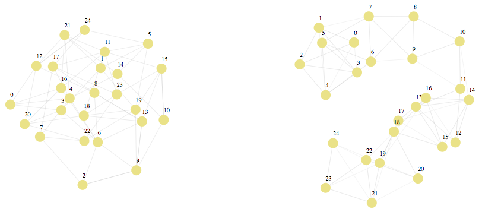

# tman-wrtc [](https://travis-ci.org/RAN3D/tman-wrtc)

<i>Keywords: T-Man, configurable network topology, WebRTC</i>

This project aims to provide an implementation of the T-Man [1] using
WebRTC. T-Man is a protocol that builds an overlay network based on
descriptors. Created by the developer, and exploiting the descriptors, a fitness
function allows choosing the right neighborhood. For instance, implementing
the distributed hash table Chord on top of T-Man is possible [2].

# Principle

<p align='center'>
    
</p>

As the screenshot shows, each peer maintains a random peer-sampling protocol (on
the left) which allows clustering protocols to avoid local minima, and a
clustering protocol (on the right) that collects, sorts, and keeps descriptors
along with sockets. On this example, descriptors are numbers and each peer keeps
4 neighbors: its closest in terms of euclidean distance. After a few shufflings,
this overlay network remains stable, for peers do not leave nor join the
network, and descriptors are not updated. Peers iterate over closer-and-closer
neighbors until they reach their optimal position. On the opposite, the random
peer-sampling protocol stays dynamic over time.

## Installation

```$ npm install tman-wrtc```

## References

[1] M. Jelasity, A. Montresor, and O. Babaoglu. [T-man: Gossip-based fast overlay topology construction](http://citeseerx.ist.psu.edu/viewdoc/download?doi=10.1.1.217.1149&rep=rep1&type=pdf)<i> Comput. Netw., vol. 53, no. 13, pp. 2321-2339, 2009.</i>


[2] A. Montresor, M. Jelasity, O. Babaoglu, [Chord on Demand](http://ieeexplore.ieee.org/document/1551024/) <i>Fifth IEEE International Conference on Peer-to-Peer Computing (P2P'05), pp. 87-94, 2005.</i>